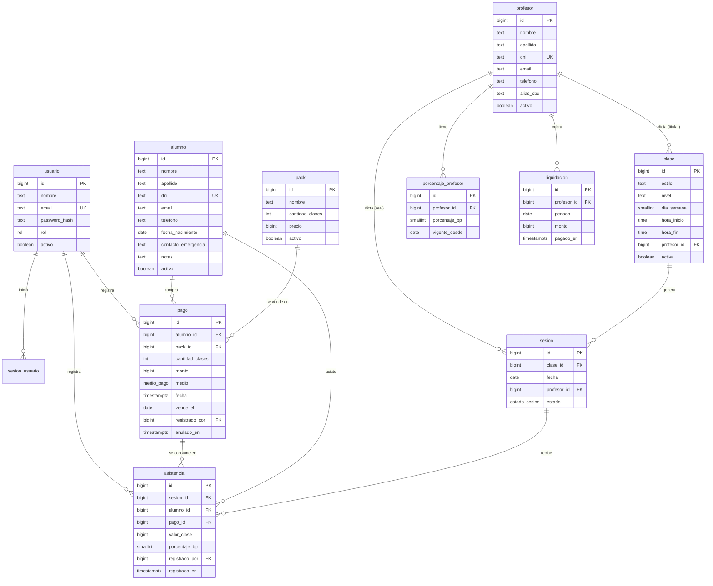

# Estructura de base de datos

Diseño de la base para la versión web del sistema de gestión del estudio de danza. Motor: PostgreSQL.

## Contexto del negocio

- El sistema lo usa solo el personal del estudio: administradores y recepción. Los alumnos no entran al sistema.
- Se venden packs de N clases (x4, x8, x16) y la clase suelta. La clase suelta es un pack de 1 clase.
- Un pack vence 1 mes después de la compra. Las clases que no se usaron se pierden.
- Un pack sirve para cualquier clase del estudio.
- Al profesor se le paga un porcentaje de lo que vale cada clase de cada alumno que asistió.

## Decisiones principales

1. **Separar el horario de la clase dictada.** `clase` es el horario semanal fijo ("Hip-Hop, martes 19:00"). `sesion` es una clase que ocurrió en una fecha, con el profesor que la dio de verdad. La asistencia apunta a la sesión. Así se pueden registrar suplencias y cancelaciones, y el historial no cambia si mañana se modifica el horario.
2. **El pago guarda lo que se cobró.** `pago.monto` es lo que pagó el alumno ese día. Si el precio del pack sube, los pagos anteriores y los sueldos ya calculados no cambian.
3. **El valor de cada asistencia se fija al registrarla.** `asistencia.valor_clase` = `pago.monto / pago.cantidad_clases`, redondeado. `asistencia.porcentaje_bp` copia el porcentaje vigente del profesor en ese momento. El sueldo es la suma de `valor_clase * porcentaje_bp / 10000` y no depende de datos que puedan cambiar después.
4. **Las clases restantes se calculan, no se guardan.** Restantes = `pago.cantidad_clases - asistencias del pago`. Con un contador aparte (`cantidad_restante` en la app original) el número se desincronizaba al borrar o cambiar asistencias.
5. **Nada que tenga historial se borra.** Packs, clases, profesores y alumnos se marcan `activo = false`. Un pago mal cargado se anula (`anulado_en`), no se elimina.
6. **El pago copia los datos del pack.** `pago.cantidad_clases` copia `pack.cantidad_clases` al momento de la compra. Si el pack cambia, el pago conserva lo que el alumno compró.
7. **El dinero se guarda como entero, en pesos.** No hay centavos en el sistema: los precios del estudio son montos redondos. Todas las columnas de dinero son `bigint`. Un pack de $8.000 se guarda como `8000`. Así no hay decimales de punto flotante ni conversiones de string, porque el driver de Postgres devuelve `numeric` como string.
8. **Los porcentajes se guardan como entero, en puntos básicos.** `porcentaje_bp` va de 1 a 10000, donde 10000 es el 100% y 5000 es el 50%. Un profesor que cobra el 52,5% se guarda como `5250`. Mismo motivo que el dinero.

### Redondeo

El único redondeo del sistema pasa en dos lugares y siempre es al entero más cercano (medio para arriba):

- `valor_clase = round(pago.monto / pago.cantidad_clases)`
- monto del profesor por asistencia = `round(valor_clase * porcentaje_bp / 10000)`

La diferencia por redondeo es de como máximo un peso por asistencia, y queda del lado del estudio.

## Diagrama



## Tablas

### Tipos

```sql
create type rol as enum ('admin', 'recepcion');
create type medio_pago as enum ('efectivo', 'transferencia', 'mercado_pago', 'otro');
create type estado_sesion as enum ('programada', 'dictada', 'cancelada');
```

### usuario

Personal que entra al sistema. `admin` gestiona precios, packs, profesores y sueldos. `recepcion` registra alumnos, pagos y asistencias.

```sql
create table usuario (
  id            bigint generated always as identity primary key,
  nombre        text not null,
  email         text not null unique,
  password_hash text not null,
  rol           rol  not null,
  activo        boolean not null default true,
  creado_en     timestamptz not null default now()
);
```

### sesion_usuario

Sesiones de login. La cookie guarda solo el `id`. Cerrar sesión o bloquear a un usuario es borrar sus filas.

```sql
create table sesion_usuario (
  id          text primary key,              -- valor aleatorio, no secuencial
  usuario_id  bigint not null references usuario (id) on delete cascade,
  expira_en   timestamptz not null,
  creado_en   timestamptz not null default now()
);

create index sesion_usuario_usuario_idx on sesion_usuario (usuario_id);
```

### alumno

`email` es opcional: mucha gente que llega a tomar una clase suelta no lo da. `dni` es opcional por el mismo motivo, pero si se carga no se puede repetir.

```sql
create table alumno (
  id                  bigint generated always as identity primary key,
  nombre              text not null,
  apellido            text not null,
  dni                 text unique,
  email               text,
  telefono            text,
  fecha_nacimiento    date,
  contacto_emergencia text,
  notas               text,
  activo              boolean not null default true,
  creado_en           timestamptz not null default now()
);

create index alumno_busqueda_idx on alumno (lower(apellido), lower(nombre));
```

### profesor

```sql
create table profesor (
  id         bigint generated always as identity primary key,
  nombre     text not null,
  apellido   text not null,
  dni        text unique,
  email      text,
  telefono   text,
  alias_cbu  text,
  activo     boolean not null default true,
  creado_en  timestamptz not null default now()
);
```

### porcentaje_profesor

Historial del porcentaje que cobra cada profesor. El vigente es el de `vigente_desde` más reciente que no sea futuro. Si el porcentaje cambia en junio, las asistencias de mayo siguen con el anterior.

```sql
create table porcentaje_profesor (
  id            bigint generated always as identity primary key,
  profesor_id   bigint not null references profesor (id),
  porcentaje_bp smallint not null check (porcentaje_bp > 0 and porcentaje_bp <= 10000),
  vigente_desde date not null,
  unique (profesor_id, vigente_desde)
);
```

### pack

Catálogo de lo que se vende. La clase suelta es un pack con `cantidad_clases = 1`.

```sql
create table pack (
  id              bigint generated always as identity primary key,
  nombre          text not null,
  cantidad_clases int  not null check (cantidad_clases > 0),
  precio          bigint not null check (precio >= 0),
  activo          boolean not null default true
);
```

### pago

Una compra de un pack. `cantidad_clases` y `monto` se copian al momento de la compra. `vence_el` se calcula como la fecha de compra + 1 mes, y el admin lo puede extender (por ejemplo, por una lesión).

```sql
create table pago (
  id              bigint generated always as identity primary key,
  alumno_id       bigint not null references alumno (id),
  pack_id         bigint not null references pack (id),
  cantidad_clases int    not null check (cantidad_clases > 0),
  monto           bigint not null check (monto >= 0),
  medio           medio_pago not null,
  fecha           timestamptz not null default now(),
  vence_el        date not null,
  registrado_por  bigint not null references usuario (id),
  anulado_en      timestamptz,
  motivo_anulacion text
);

create index pago_alumno_idx on pago (alumno_id, vence_el);
```

### clase

Horario semanal fijo. `dia_semana` sigue ISO 8601: 1 = lunes, 7 = domingo. `profesor_id` es el titular.

```sql
create table clase (
  id           bigint generated always as identity primary key,
  estilo       text not null,
  nivel        text,
  dia_semana   smallint not null check (dia_semana between 1 and 7),
  hora_inicio  time not null,
  hora_fin     time not null check (hora_fin > hora_inicio),
  profesor_id  bigint not null references profesor (id),
  activa       boolean not null default true
);
```

### sesion

Una clase en una fecha concreta. Se crea cuando recepción abre la clase del día para tomar asistencia. `profesor_id` arranca con el titular y se cambia si hay una suplencia.

```sql
create table sesion (
  id           bigint generated always as identity primary key,
  clase_id     bigint not null references clase (id),
  fecha        date   not null,
  profesor_id  bigint not null references profesor (id),
  estado       estado_sesion not null default 'programada',
  unique (clase_id, fecha)
);

create index sesion_profesor_fecha_idx on sesion (profesor_id, fecha);
```

### asistencia

Un alumno que asistió a una sesión y usó una clase de un pago. `valor_clase` y `porcentaje_bp` se copian al registrar la asistencia.

```sql
create table asistencia (
  id                  bigint generated always as identity primary key,
  sesion_id           bigint not null references sesion (id),
  alumno_id           bigint not null references alumno (id),
  pago_id             bigint not null references pago (id),
  valor_clase          bigint   not null check (valor_clase >= 0),
  porcentaje_bp        smallint not null check (porcentaje_bp > 0 and porcentaje_bp <= 10000),
  registrado_por      bigint not null references usuario (id),
  registrado_en       timestamptz not null default now(),
  unique (sesion_id, alumno_id)
);

create index asistencia_pago_idx on asistencia (pago_id);
```

### liquidacion

Lo que se le pagó a cada profesor por mes. Una vez creada, el monto queda fijo aunque después se corrija una asistencia de ese mes. Sin esta tabla, el sueldo de un mes cerrado se podría recalcular distinto.

```sql
create table liquidacion (
  id           bigint generated always as identity primary key,
  profesor_id  bigint not null references profesor (id),
  periodo      date   not null check (extract(day from periodo) = 1),
  monto        bigint not null check (monto >= 0),
  pagado_en    timestamptz,
  registrado_por bigint not null references usuario (id),
  unique (profesor_id, periodo)
);
```

## Reglas de negocio

La base no puede validar todas las reglas con `check`. Estas quedan en el backend y se ejecutan dentro de una transacción.

**Registrar una asistencia**

1. El alumno elige un pago que cumpla todo esto:
   - `anulado_en is null`;
   - `vence_el >= sesion.fecha`;
   - clases usadas < `cantidad_clases`.
2. Si tiene más de un pago válido, se usa el que vence primero.
3. Si no tiene ninguno, recepción cobra una clase suelta en el mismo paso: crea el pago y la asistencia en la misma transacción.
4. La sesión no puede estar `cancelada`.
5. Se bloquea el pago con `select ... for update` antes de contar las asistencias. Así dos recepcionistas no pueden usar la última clase del pack al mismo tiempo.

**Anular un pago**

- No se puede anular un pago con asistencias. Primero hay que borrar o mover esas asistencias.

**Cancelar una sesión**

- Solo si no tiene asistencias. Si ya tenía, se borran primero y las clases vuelven al pack del alumno.

## Consultas principales

**Clases restantes de un pago**

```sql
select p.id,
       p.cantidad_clases - count(a.id) as restantes,
       p.vence_el
from pago p
left join asistencia a on a.pago_id = p.id
where p.alumno_id = $1
  and p.anulado_en is null
  and p.vence_el >= current_date
group by p.id
having p.cantidad_clases - count(a.id) > 0
order by p.vence_el;
```

**Sueldo de un profesor en un mes**

```sql
select s.profesor_id,
       count(a.id) as asistencias,
       sum(round(a.valor_clase * a.porcentaje_bp / 10000.0)) as sueldo
from asistencia a
join sesion s on s.id = a.sesion_id
where s.profesor_id = $1
  and s.fecha >= $2::date                        -- primer día del mes
  and s.fecha <  $2::date + interval '1 month'
group by s.profesor_id;
```

**Ingresos del mes**

```sql
select medio, sum(monto) as total
from pago
where anulado_en is null
  and fecha >= $1::date
  and fecha <  $1::date + interval '1 month'
group by medio;
```

## Cambios respecto de la app original

| Problema original | Solución |
|---|---|
| `clase` sin fecha: no hay suplencias ni cancelaciones | tabla `sesion` con `fecha` y `profesor_id` real |
| El sueldo usaba `pack.precio` actual | `pago.monto` y `asistencia.valor_clase` se fijan al momento |
| Sueldo = 100% de lo cobrado, con `switch` por id de pack | `porcentaje_profesor` con historial; `valor_clase = monto / cantidad_clases` |
| Montos con decimales (`numeric`) leídos como string | todo el dinero en pesos enteros con `bigint`; porcentajes en puntos básicos |
| `cantidad_restante` se desincronizaba | se calcula contando asistencias |
| Vencimiento de 30 días fijo en una query | `pago.vence_el`, editable |
| Cambiar de pack reiniciaba las clases usadas | el pago no se modifica; se anula y se crea otro |
| FK nullable, sin `check` | FK `not null`, `check` en montos, horarios y cantidades |
| `email` obligatorio para alumnos | opcional |
| `dia_semana` como texto ("Miercoles") | `smallint` 1 a 7 |
| Borrar un alumno con pagos fallaba por FK | borrado lógico con `activo` |
| Un solo login fijo `admin/1234` | tabla `usuario` con `rol` y contraseña hasheada |
| `clase_suelta` era el pack con id 1 fijo | es cualquier pack con `cantidad_clases = 1` |

## Preguntas abiertas

1. **Clases adeudadas.** ¿Un alumno puede tomar la clase y pagar después? Si es así, `asistencia.pago_id` pasa a ser nullable y hace falta una vista de deudas.
2. **Cambio de pack.** Si un alumno compró un x4, usó 1 clase y quiere pasar a un x8, ¿cómo se cobra? Propuesta: anular el x4, crear un pago x8 por la diferencia y mover la asistencia usada al pago nuevo.
3. **Sesiones.** ¿Recepción abre la sesión del día al tomar asistencia, o el sistema genera todas las sesiones del mes por adelantado? La segunda opción permite ver el calendario, pero hay que generar sesiones nuevas cuando se crea o cambia una clase.
4. **Otros egresos.** ¿El sistema tiene que registrar alquiler, servicios u otros gastos para calcular la ganancia del mes? Si es así, se agrega una tabla `egreso`.
5. **Cupo.** ¿Alguna clase tiene cupo máximo? Si es así, se agrega `clase.cupo`.
6. **Porcentaje por clase.** ¿Un profesor cobra el mismo porcentaje en todas sus clases, o puede variar por clase? Si varía, el porcentaje pasa a `clase` o a una tabla profesor-clase.
